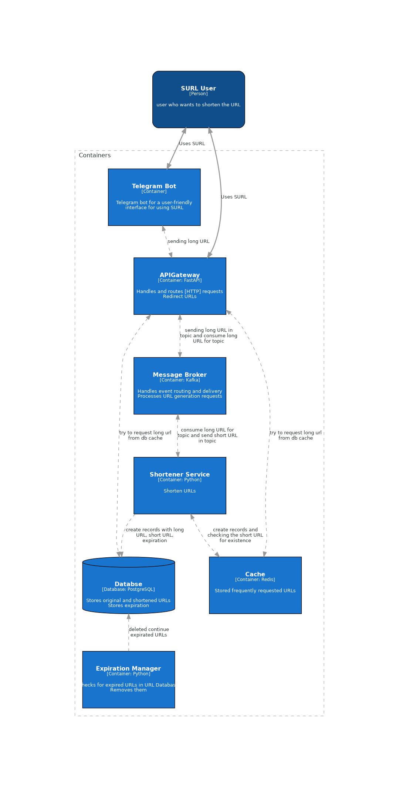

  

  <b><a href="https://neojelll/surl" target="_blank">SURL</a> - service for fast and convenient shortening of long links into neat short links</b>

	
  
	
	
	
	

## Description

A SURL is a handy tool, long long hair, complex URLs in short places, easy to remember links. Ideal for routing traffic on your social media pages, email campaigns and websites. Simplify your links and track their performance in one place!

## Project Focus

- Make the process of link shortening as simple as possible and user-friendly

- Provide data analytics via a shortened link

## Use Cases

### General

- A user submits a request with a link that he wants to shorten using cURL

  Parameter|Default value|Description
  -|-|-
  expiration | 1 day | link validity time
  prefix | empty string | link prefix

- In response he receives a short link
- When using a short link, it will be redirected to the original one
- If the link has expired, the user will receive a static page in response with information that the link did not exist or is no longer valid

### WebUI

All the same as described in General, using SPA (Single Page Application) WebUI

### Telegram

All the same as described in General, using a bot in Telegram

## Architecture

### Containers Diagram

